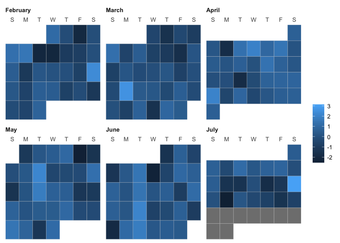
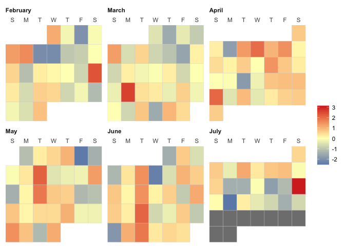
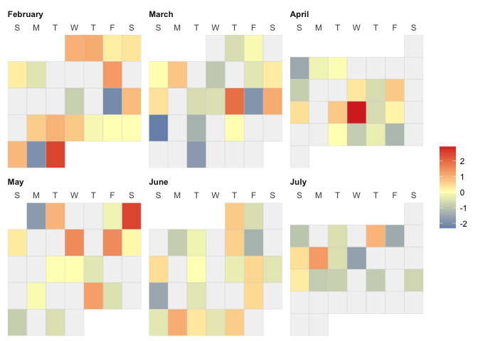
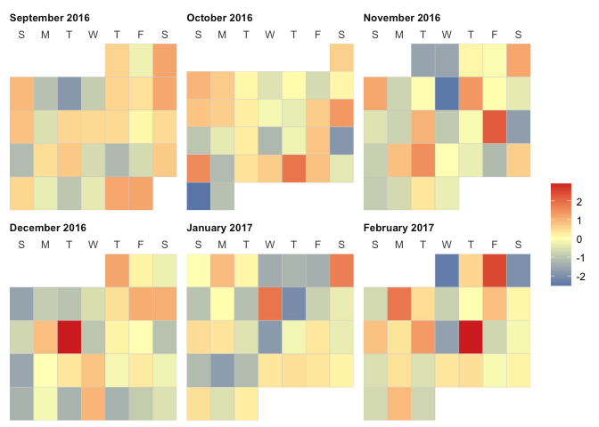

`ggcal` is a simple package to generate a familiar calendar plot from a vector of dates and fill values.

Installation
------------

``` r
devtools::install_github("jayjacobs/ggcal")
```

Generating a simple calendar plot
---------------------------------

``` r
library(ggplot2)
library(ggcal)

mydate <- seq(as.Date("2017-02-01"), as.Date("2017-07-22"), by="1 day")
myfills <- rnorm(length(mydate))

print(ggcal(mydate, myfills))
```



The function returns as base ggplot object, which can be modified with `scale_fill_*`

``` r
gg <- ggcal(mydate, myfills) +
  scale_fill_gradient2(low="#4575b4", mid="#ffffbf", high="#d73027", midpoint=0)

print(gg)
```



Notice how the last few days in July are missing in the original data and are set to a dark gray by default. This can be overridden in the `scale_fill_*` function.

``` r
mydate2 <- sample(mydate, 100) 
myfills2 <- rnorm(length(mydate2))

gg <- ggcal(mydate2, myfills2) +
  scale_fill_gradient2(low="#4575b4", mid="#ffffbf", high="#d73027", midpoint=0,
                       na.value="gray95")

print(gg)
```



The fill values also do not have to be a continuous variable.

``` r
mydate <- seq(as.Date("2017-02-01"), as.Date("2017-07-31"), by="1 day")
myfills <- ifelse(format(mydate, "%w") %in% c(0,6), "weekend" ,"weekday")

ggcal(mydate, myfills) + scale_fill_manual(values=c("weekday"="steelblue", "weekend"="lightsteelblue"))
```


This will also span multiple years...

``` r
mydate <- seq(as.Date("2016-09-01"), as.Date("2017-02-28"), by="1 day")
myfills <- rnorm(length(mydate))

ggcal(mydate, myfills) + 
    scale_fill_gradient2(low="#4575b4", mid="#ffffbf", high="#d73027", midpoint=0)
```


